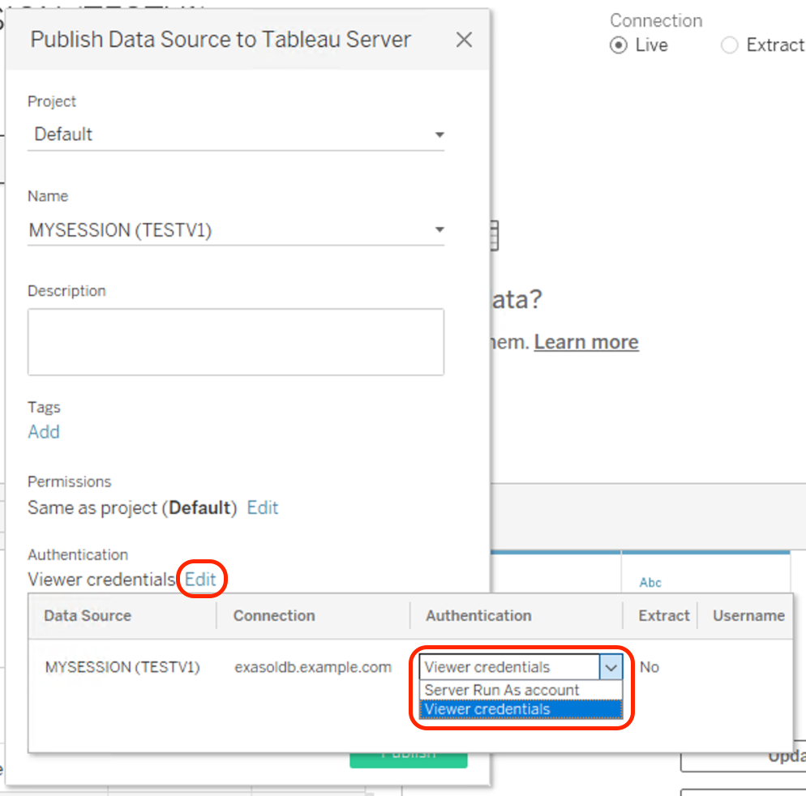

# User Guide

The Exasol ODBC Tableau Connector is distributed together with Tableau Desktop and Tableau Server applications. We recommend using the latest available version of Tableau products to access the connector.


If you want to use the currently developed versions of connector for JDBC and ODBC, you can follow the guide below and install the connector disabling sign verification.

## Testing In-Development Connector

You can download the latest connectors for JDBC and ODBC as `.taco` files from the [GitHub release page](https://github.com/exasol/tableau-connector/releases).

### Preconditions

#### Install the JDBC Driver

The connector for JDBC requires the Exasol JDBC driver to be installed for Tableau Desktop and Server.

Download and install the latest Exasol JDBC driver for your operating system from the [Exasol download page](https://www.exasol.com/portal/display/DOWNLOAD/).

**Important note for Kerberos:** When using Kerberos on Tableau Server you need at least version 7.1.3 of the Exasol JDBC driver.

**Important note for Windows:** Make sure to download and install file `EXASOL_JDBC-<version>.msi`. This will install the JDBC driver to `C:\Program Files\Exasol\EXASolution-7.1\JDBC\exajdbc.jar`. Only the JDBC driver for Windows supports Kerberos under Windows.

Copy the JDBC driver `exajdbc.jar` to the Tableau installation directory:

* Tableau Desktop (see [Tableau Desktop documentation](https://help.tableau.com/current/pro/desktop/en-us/examples_otherdatabases_jdbc.htm#specify-the-right-jdbc-driver) for details):
  * `C:\Program Files\Tableau\Drivers` (Windows)
  * `~/Library/Tableau/Drivers` (macOS)
* Tableau Server:
  * Windows: `C:\Program Files\Tableau\Drivers`
  * Linux: `/opt/tableau/tableau_driver/jdbc`

#### Install the ODBC Driver

The connector for ODBC requres the Exasol ODBC driver to be installed for Tableau Desktop and Server.

Download and install the latest Exasol ODBC driver for your operating system from the [Exasol download page](https://www.exasol.com/portal/display/DOWNLOAD/).

* Windows and macOS: install the driver by executing the installer.
* Linux:
  1. Unpack the ODBC driver to `/opt/exasol/odbc`
  2. Create or edit file `/etc/odbcinst.ini` and add the following entry:

      ```ini
      [EXASolution Driver]
      Driver=/opt/exasol/odbc/lib/linux/x86_64/libexaodbc-uo2214lv2.so
      ```

### Install the Connectors With Tableau Desktop

1. Copy the connector `.taco` files to
  * `C:\Users\[Windows User]\Documents\My Tableau Repository\Connectors` (Windows)
  * `/Users/[user]/Documents/My Tableau Repository/Connectors` (macOS)
2. As the connectors are not signed, you need to start Tableau Desktop with command line argument `-DDisableVerifyConnectorPluginSignature`, e.g. by creating a `.bat` file with the following content:

    ```bat
    "C:\Program Files\Tableau\Tableau <version>\bin\tableau.exe" -DDisableVerifyConnectorPluginSignature
    ```

See details in the documentation for [Tabeleau Desktop](https://help.tableau.com/current/pro/desktop/en-us/examples_connector_sdk.htm) and the [Tableau Connector SDK](https://tableau.github.io/connector-plugin-sdk/docs/run-taco).

### Install the Connectors With Tableau Server

1. Copy the connector `.taco` files to
  * `/var/opt/tableau/tableau_server/data/tabsvc/vizqlserver/Connectors/` (Linux)
  * `C:\Program Files\Tableau\Connectors` (Windows)
2. As the connectors are not signed, you need to disable the signature verification and apply changes:

    ```shell
    tsm configuration set -k native_api.disable_verify_connector_plugin_signature -v true --force-keys
    tsm pending-changes apply
    ```

## Using the Connectors

After installing the connectors, you can use them by selecting connector "EXASOL JDBC by Exasol AG" resp. "EXASOL ODBC by Exasol AG". This will open a connection dialog where you can enter details for connecting to your Exasol database.

### JDBC Connector: TLS Certificate Validation

The JDBC connector will always create a TLS encrypted connection to the Exasol database.

Using the "Validate Server Certificate" checkbox you can configure if the connector should verify the Exasol server's TLS certificate. This is on by default and we recommend keeping it on.

If your Exasol server does not have a valid TLS certificate with the correct hostname (e.g. the default self-signed certificate), you will need to enter the fingerprint of the servers' certificate into the text field "Server Certificate Fingerprint". This ensures that you connect to the correct server and there is no person-in-the-middle attack going on.

You can find the fingerprint via the EXAoperation user interface.

### JDBC Connector: Authentication

For authentication against the database you have two options:

1. Username and password
2. Kerberos/Active Directory

#### Username and Password

This is for database users created with a password:

```sql
CREATE USER <user> IDENTIFIED BY "<password>";
```

To use this, select "Username and Password" in the "Authentication" drop-down-list and enter username and password. This works on both Tableau Desktop and Server.

#### Kerberos/Active Directory

This is for database users created with Kerberos authentication:

```sql
CREATE USER <user> IDENTIFIED BY KERBEROS PRINCIPAL "<user@EXAMPLE.COM>";
```

To use this, select "Kerberos" in the "Authentication" drop-down-list. Entering username and password is not necessary, the connector will use the Kerberos credentials provided by your operating system to connect to Exasol.

##### Prerequisites

These preprequisites are necessary for using Kerberos with both Tableau Desktop and Server:

* The Exasol database is configured to use [Kerberos Single Sign-On](https://docs.exasol.com/administration/on-premise/access_management/kerberos_sso.htm). You can create the keytab file by executing this command on the Windows Domain Controller:

  ```sh
  ktpass -out exasol.keytab -mapuser <user> -princ exasol/<fully qualified hostname>@<REALM> -pass <user password> -ptype KRB5_NT_PRINCIPAL -target <REALM> -crypto All
  # Example:
  ktpass -out exasol.keytab -mapuser exasoluser -princ exasol/exasoldb.example.com@EXAMPLE.COM -pass **** -ptype KRB5_NT_PRINCIPAL -target EXAMPLE.COM -crypto All
  ```

* Kerberos uses service name `exasol` for the database.
* You use the fully qualified hostname of the Exasol server (e.g. `exasoldb.example.com`) to connect to the database. Using an IP address is not possible.
* The clocks of all machines, especially the Exasol database must be in sync. We recommend to synchronize time by configuring an NTP Server.

##### Using Kerberos With Tableau Desktop

When selecting Kerberos authentication in Tableau Desktop, the connector will use the credentials of the current Windows/macOS user to login to Exasol.

##### Using Kerberos With Tableau Server

With Tableau Server, there are two options for using Kerberos authentication:

###### RunAs / Service Account

This will use the Tableau Server's Kerberos credentials for accessing the Exasol database instead of the user's account. See the Tableau documentation for [Linux](https://help.tableau.com/current/server-linux/en-us/kerberos_runas_linux.htm) and [Windows](https://help.tableau.com/current/server/en-us/kerberos_runas_jdbc.htm) for instructions how to configure this.

###### Kerberos Delegation

With delegation, the Tableau Server will forward the user's Kerberos credentials to the Exasol database.

See the Tableau documentation for [Linux](https://help.tableau.com/current/server-linux/en-us/kerberos_delegation.htm) and [Windows](https://help.tableau.com/current/server/en-us/kerberos_delegation_jdbc.htm) for instructions how to configure this.

To use this feature you need to publish a data source via Tableau Desktop:

1. Login to your Tableau Server using Tableau Desktop.
2. Create a new data source in Tableau Desktop using Kerberos authentication.
3. Select menu *Server* > *Publish Data Source* > *(Your data source)*.
4. Click the *Edit* link next to Authentication and select *Viewer Credentials* for Authentication:

5. Click the *Publish* button.
6. In Tableau Server create a new Workbook using the data source.

### Troubleshooting

#### Authentication Fails

```
Can’t connect to Exasol JDBC by Exasol AG
Detailed Error Message
Connection exception - authentication failed.
Unable to connect to the Exasol JDBC by Exasol AG server "exasoldb.example.com". Check that the server is running and that you have access privileges to the requested database.
```

This is a general error message when authentication fails.

When using Username and Password authentication, check that username and password are correct.

When using Kerberos authentication check the following:

* Verify that the clocks on all machines are synchronized. For the Exasol database you can do the following:
  * Check the current time of Exasol by running SQL query `select CURRENT_TIMESTAMP`.
  * Configure one or more NTP servers as described in the [documentation](https://docs.exasol.com/administration/aws/manage_network.htm).
  * Manually trigger NTP synchronization via [EXAOperation Cluster Monitoring](https://docs.exasol.com/administration/aws/monitoring/cluster_monitoring_services.htm).
* Verify that Active Directory is setup correctly by running command `dcdiag` on the Domain Controller.
* Make sure to use the JDBC driver jar for the correct platform (Windows/Linux/Unix). The driver for Windows contains an additional library required for Kerberos on Windows.
* [Download cluster logs](https://docs.exasol.com/administration/aws/support/cluster_logs.htm) from Exasol and check files `*ConnectionServer*` for error messages:
  * `Request ticket server exasol/exasoldb.example.com@EXAMPLE.COM kvno 12 found in keytab but not with enctype aes128-cts`:
    The keytab does not contain AES encrypted credentials. Generate a new keytab with option `-crypto All` (recommended) or disable AES for the Exasol service user in Active Directory via options *This account supports Kerberos AES 128 bit encryption* and *This account supports Kerberos AES 256 bit encryption*.
  * `Request ticket server exasol/exasoldb.example.com@EXAMPLE.COM kvno 10 not found in keytab; keytab is likely out of date`:
  The Exasol service user's password might have been changed. Generate a new keytab file and and upload it via EXAoperations.

#### Missing certificate on Tableau Server

```
Can’t connect to Exasol JDBC by Exasol AG
Detailed Error Message

Unable to connect to the Exasol JDBC by Exasol AG server "exasoldb.example.com". Check that the server is running and that you have access privileges to the requested database.
```

This error may occur on Tableau Server when certificate validation is enabled but the Exasol database uses a self-signed TLS certificate.

To fix this, enter the certificate's fingerprint in the connection dialog.

#### Missing Certificate Fingerprint on Tableau Desktop

```
java.io.IOException: TLS connection to host (exasoldb.example.com) failed: PKIX path building failed: sun.security.provider.certpath.SunCertPathBuilderException: unable to find valid certification path to requested target. If you trust the server, you can include the fingerprint in the connection string: exasoldb.example.com/ABD591342466880A16A4443DEEFF44A78A26E47514BE4D5E1C4CB712345F69CA:8563. 
Unable to connect to the Exasol JDBC by Exasol AG server "exasoldb.example.com". Check that the server is running and that you have access privileges to the requested database.
```

This error may occur when certificate validation is enabled but the Exasol database uses a self-signed TLS certificate.

To fix this, enter the certificate's fingerprint in the connection dialog.

#### `GRANT SESSION` Privilige Missing

```
Connection exception - insufficient privileges: CREATE SESSION.
Unable to connect to the Exasol JDBC by Exasol AG server "exasoldb.example.com". Check that the server is running and that you have access privileges to the requested database.
Connector Class: exasol_jdbc, Version: 1.0.0
For support, contact Exasol AG.
````

```sql
GRANT CREATE SESSION TO "<user>"
```

#### Outdated JDBC Driver

```
SQLInvalidAuthorizationSpecException: No LoginModules configured for exasol
```

This error may occur when using an outdated version of the Exasol JDBC driver with Tableau Desktop. Use version 7.1.3 or later.
