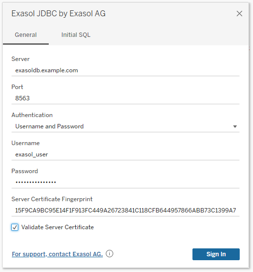

# User Guide

The Exasol Tableau Connector is distributed together with Tableau Desktop and Tableau Server applications. We recommend using the latest available version of Tableau products to access the connector.



If you want to use the currently developed version of connector, you can follow the guide below and install the connector disabling sign verification.

## Testing In-Development Connector

The ODBC Connector is deprecated, we recommend using the JDBC Connector. You can download the latest connector as a `.taco` file from the [GitHub release page](https://github.com/exasol/tableau-connector/releases).

### Install the JDBC Driver

Download and install the latest JDBC driver for your operating system from the [download page](https://www.exasol.com/portal/display/DOWNLOAD/).

**Important note for Windows:** Make sure to download and install file `EXASOL_JDBC-<version>.msi`. This will install the JDBC driver to `C:\Program Files\Exasol\EXASolution-7.1\JDBC\exajdbc.jar`. Only the JDBC driver for Windows supports Kerberos under Windows.

See below for where to install the JDBC driver in Tableau Desktop and Tableau Server.

### With Tableau Desktop

1. Copy the JDBC driver `exajdbc.jar` to the Tableau installation directory (see [Tableau Desktop documentation](https://help.tableau.com/current/pro/desktop/en-us/examples_otherdatabases_jdbc.htm#specify-the-right-jdbc-driver) for details).
  * `C:\Program Files\Tableau\Drivers` (Windows)
  * `~/Library/Tableau/Drivers` (macOS)
2. Copy the connector `.taco` file to
  * `C:\Users\[Windows User]\Documents\My Tableau Repository\Connectors` (Windows)
  * `/Users/[user]/Documents/My Tableau Repository/Connectors` (macOS)
3. As the connector is not signed, you need to start Tableau Desktop with command line argument `-DDisableVerifyConnectorPluginSignature`, e.g. by creating a `.bat` file with the following content:

    ```bat
    "C:\Program Files\Tableau\Tableau 2021.3\bin\tableau.exe" -DDisableVerifyConnectorPluginSignature
    ```

See details in the documentation for [Tabeleau Desktop](https://help.tableau.com/current/pro/desktop/en-us/examples_connector_sdk.htm) and the [Tableau Connector SDK](https://tableau.github.io/connector-plugin-sdk/docs/run-taco).

### With Tableau Server

#### Install the JDBC Driver

1. Copy the JDBC driver `exajdbc.jar` to the Tableau installation directory:
  * Windows: `C:\Program Files\Tableau\Drivers`
  * Linux: `/opt/tableau/tableau_driver/jdbc`
2. Copy the connector `.taco` file to
  * `/var/opt/tableau/tableau_server/data/tabsvc/vizqlserver/Connectors/` (Linux)
  * `C:\Program Files\Tableau\Connectors` (Windows)
3. As the connector is not signed, you need to disable the signature verification and apply changes:

    ```shell
    tsm configuration set -k native_api.disable_verify_connector_plugin_signature -v true --force-keys
    tsm pending-changes apply
    ```

## Using the JDBC Connector

After installing the JDBC Connector, you can use it by selecting connector "EXASOL JDBC by Exasol AG". This will open a connection dialog where you can enter details for connecting to your Exasol database.

### TLS Certificate Validation

The JDBC connector will always create a TLS encrypted connection to the Exasol database.

Using the "Validate Server Certificate" checkbox you can configure if the connector should verify the Exasol server's TLS certificate. This is on by default and we recommend to keep it on.

If your Exasol server does not have a valid TLS certificate with the correct hostname (e.g. the default self-signed certificate), you will need to enter the fingerprint of the servers certificate into text field "Server Certificate Fingerprint". This ensures that you connect to the correct server and there is no person-in-the-middle attack going on.

You can find the fingerprint via the EXAoperation user interface.

### Authentication

For authentication against the database you have two options:

1. Username and password
2. Kerberos/Active Directory

#### Username and Password

This is for database users created with a password:

```sql
CREATE USER <user> IDENTIFIED BY "<password>";
```

To use this, select "Username and Password" in the "Authentication" drop-down-list and enter username and password.

#### Kerberos/Active Directory

This is for database users created with Kerberos authentication:

```sql
CREATE USER <user> IDENTIFIED BY KERBEROS PRINCIPAL "<user@EXAMPLE.COM>";
```

To use this, select "Kerberos" in the "Authentication" drop-down-list. Entering username and password is not necessary, the connector will use the Kerberos credentials provided by your operating system to connect to Exasol.

##### Prerequisites

* The Exasol database is configured to use [Kerberos Single Sign-On](https://docs.exasol.com/administration/on-premise/access_management/kerberos_sso.htm).
* Kerberos uses service name `exasol` for the database.
* You use the fully qualified hostname of the Exasol server (e.g. `exasoldb.example.com`) to connect to the database. Using an IP address is not possible.
* The clocks of all machines, especially the Exasol database must be in sync. We recommend to synchronize time by configuring an NTP Server.

##### Tableau Server

With Tableau Server, there are two options for using Kerberos authentication:

###### RunAs / Service Account

This will use the Tableau Server's Kerberos credentials for accessing the Exasol database instead of the user's account. See configuration instructions for [Linux](https://help.tableau.com/current/server-linux/en-us/kerberos_runas_linux.htm) and [Windows](https://help.tableau.com/current/server/en-us/kerberos_runas_jdbc.htm).

###### Kerberos Delegation

With delegation, the Tableau Server will forward the user's Kerberos credentials to the Exasol database. This is not yet supported by the connector, see [issue #32](https://github.com/exasol/tableau-connector/issues/32) for details.

See Tableau documentation for [Linux](https://help.tableau.com/current/server-linux/en-us/kerberos_delegation.htm) and [Windows](https://help.tableau.com/current/server/en-us/kerberos_delegation_jdbc.htm).
